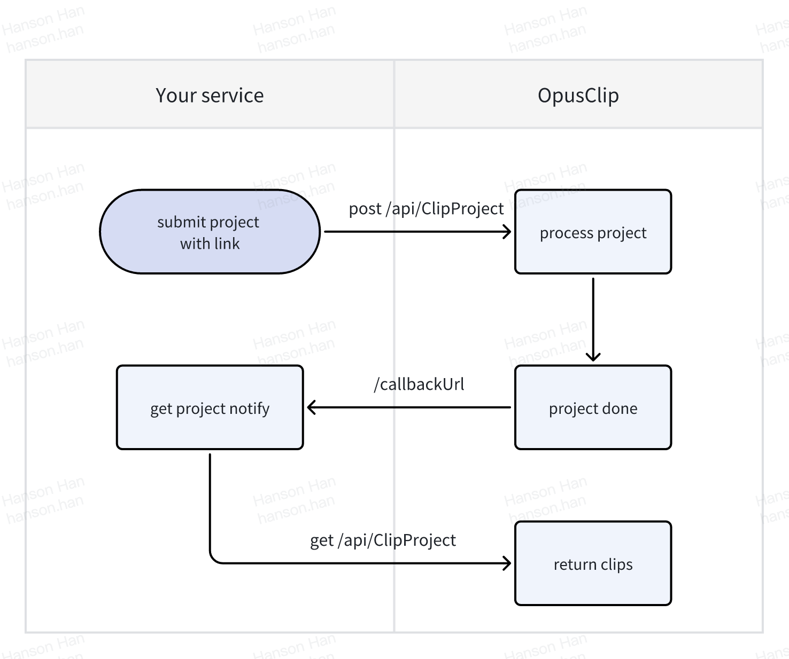

<Note>If you need a secret key as your bear token, please contact us.</Note>

## Welcome

There show you how to use OpusClip API

<Card>
  
</Card>

## Authentication

All API endpoints are authenticated using Bearer tokens and picked up from the specification file.

```json
"security": [
  {
    "bearerAuth": []
  }
]
```
