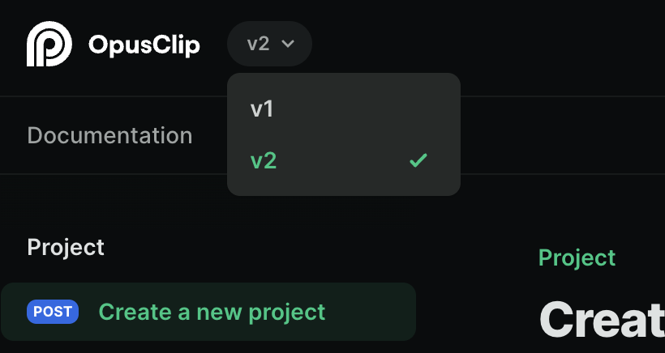

<Note>If you need a secret key to use as your bearer token, please contact us.</Note>

## Welcome

Welcome to the OpusClip API integration guide. This documentation will walk you through the steps required to effectively use the OpusClip API.

<Card>
    
</Card>

## Versioning

The OpusClip API is versioned to ensure that changes to the API do not break existing integrations. The latest version of the API is `v2`.

You can switch version by clicking on the top lef corner of the page.

<Card>
    
</Card>

## Authentication

<Note>If you require a secret key for your bearer token, please reach out to us for assistance.</Note>
